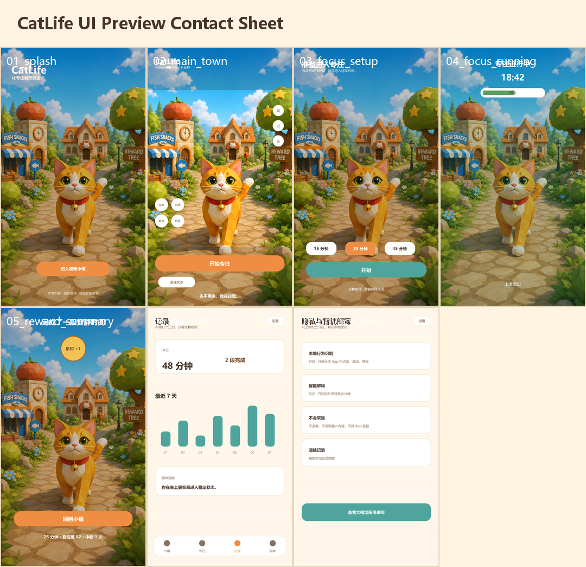

# CatLife UI Assembly Kit 2026-06-29

定位：这是后续看到即可直接实现的 UI 组装包，不是纯方案文档。

它包含：

- 7 张 1080x1920 手机界面预览图；
- 1 张总览 contact sheet；
- Unity 可导入图标和基础纹理；
- `catlife_ui_layout.json` 布局/状态映射；
- Unity 简单控制脚本；
- 一键复制到 Unity 工程的 PowerShell 脚本；
- 逐屏对象树、按钮回调、素材替换规则。

当前已确认的主页规则：

```text
Scene Layer = 只有橘猫 + 猫咪小镇背景。
UI Overlay = 顶部状态、右侧功能按钮、左下摄像机按钮、底部开始专注。
Camera = 固定高度；360 度水平原地旋转；只允许水平前后移动。
Cat = 可在摄像机范围内走动，并由用户行为判断切换动画；不依赖坐下动画。
```

## 1. 快速查看

总览图：



核心页面：

| 页面 | 预览 |
|---|---|
| 启动页 | `assets/previews/01_splash.png` |
| 主小镇页 | `assets/previews/02_main_town.png` |
| 专注准备卡 | `assets/previews/03_focus_setup.png` |
| 专注进行层 | `assets/previews/04_focus_running.png` |
| 奖励结算 | `assets/previews/05_reward_summary.png` |
| 记录页 | `assets/previews/06_records.png` |
| 隐私与智能解释 | `assets/previews/07_privacy_llm.png` |

## 2. 一键生成和安装

重新生成预览与素材：

```powershell
powershell -ExecutionPolicy Bypass -File 06-deliverables\catlife-ui-assembly-kit-20260629\scripts\build-ui-kit.ps1
```

复制到 Unity 工程：

```powershell
powershell -ExecutionPolicy Bypass -File 06-deliverables\catlife-ui-assembly-kit-20260629\scripts\install-to-unity.ps1 -UnityProjectPath "D:\YourUnityProject"
```

复制后 Unity 内位置：

```text
Assets/CatLife/UIAssemblyKit/
  assets/
  layout/
  unity-scripts/
```

## 3. Unity 场景装配目标

推荐场景：

```text
Assets/Scenes/CatLife_Main.unity
```

推荐 Hierarchy：

```text
CatLife_Main
├── TownRoot
├── CatRoot
├── CameraRig
├── LightingRoot
├── Managers
│   ├── CatLifeAppController
│   ├── FocusStateMachine
│   └── SimpleBehaviorScoreEngine
└── UIRoot
    ├── Canvas
    │   ├── SplashPanel
    │   ├── MainTownPanel
    │   ├── FocusSetupPanel
    │   ├── FocusRunningPanel
    │   ├── RewardSummaryPanel
    │   ├── RecordsPanel
    │   └── PrivacyPanel
    └── EventSystem
```

Canvas 参数：

| 项 | 值 |
|---|---|
| Render Mode | Screen Space - Overlay |
| UI Scale Mode | Scale With Screen Size |
| Reference Resolution | 1080 x 1920 |
| Match | 0.5 |
| Orientation | Portrait |

## 4. 页面装配表

| Panel | 对应预览 | 关键对象 | 按钮回调 |
|---|---|---|---|
| `SplashPanel` | `01_splash.png` | 背景图、CatLife 标题、进入按钮 | `CatLifeUIScreenController.ShowMainTown()` |
| `MainTownPanel` | `02_main_town.png` | 今日状态条、猫咪气泡、开始专注、底部导航 | `ShowFocusSetup()`、`ShowRecords()`、`ShowPrivacy()` |
| `FocusSetupPanel` | `03_focus_setup.png` | 15/25/45 分钟、模式、智能解释、开始 | `CatLifeCompetitionDemoFlow.OnStartFocusClicked()` |
| `FocusRunningPanel` | `04_focus_running.png` | 倒计时、猫咪低刺激文案、上滑退出 | `OnBackToTownClicked()` 或状态机退出 |
| `RewardSummaryPanel` | `05_reward_summary.png` | 专注时长、稳定度、中断次数、爪印 | `OnBackToTownClicked()` |
| `RecordsPanel` | `06_records.png` | 今日时长、7 天趋势、猫咪洞察 | `ShowMainTown()` |
| `PrivacyPanel` | `07_privacy_llm.png` | 本地识别、智能解释、不会采集、清除记录 | `ShowMainTown()` |

## 5. Unity 脚本接线

把 `unity-scripts/` 复制进 Unity 后，挂载：

| 脚本 | 挂载对象 | 需要拖拽引用 |
|---|---|---|
| `CatLifeUIScreenController` | `UIRoot` 或 `Managers/UIManager` | 7 个 Panel |
| `CatLifeCompetitionDemoFlow` | `Managers/DemoFlow` | `CatLifeUIScreenController` |
| `CatLifeFixedHeightCameraController` | `CameraRig` | `cameraRig`、`Main Camera` |
| `CatLifeCameraButtonHold` | 每个摄像机控制按钮 | Pointer Down/Up/Exit 事件 |
| `CatLifeCatCameraBoundsWalker` | `CatRoot` | `CatRoot`、`Animator` |

按钮事件：

| 按钮 | OnClick |
|---|---|
| 启动页进入 | `CatLifeUIScreenController.ShowMainTown` |
| 主页面开始专注 | `CatLifeUIScreenController.ShowFocusSetup` |
| 专注准备开始 | `CatLifeCompetitionDemoFlow.OnStartFocusClicked` |
| 奖励回小镇 | `CatLifeCompetitionDemoFlow.OnBackToTownClicked` |
| 底部记录 | `CatLifeCompetitionDemoFlow.OnOpenRecordsClicked` |
| 设置/隐私 | `CatLifeCompetitionDemoFlow.OnOpenPrivacyClicked` |

摄像机按钮事件：

| 按钮 | PointerDown | PointerUp / PointerExit |
|---|---|---|
| 左旋 | `CatLifeFixedHeightCameraController.HoldRotateLeft` | `StopRotate` |
| 右旋 | `CatLifeFixedHeightCameraController.HoldRotateRight` | `StopRotate` |
| 前进 | `CatLifeFixedHeightCameraController.HoldMoveForward` | `StopMove` |
| 后退 | `CatLifeFixedHeightCameraController.HoldMoveBack` | `StopMove` |

## 5.1 摄像机控制合同

| 控制 | 规则 |
|---|---|
| 左旋/右旋 | `CameraRig` 只绕世界 Y 轴水平旋转，可 360 度原地旋转 |
| 前进/后退 | 沿 `CameraRig.forward` 的水平投影移动 |
| 高度 | 始终锁定为初始 `cameraRig.position.y` |
| 禁止 | 上下移动、俯仰自由旋转、roll、顶视角切换、双指缩放 |

摄像机固定后，猫咪不固定在原地。猫可在镜头范围内走动，状态机只负责切换可用动画：`IdleBreath`、`CuriousSniff`、`HeadTiltListen`、`TailWagHappy` 等。当前不能假设存在坐下动画。

## 6. 资源导入规则

| 资源 | Unity Import |
|---|---|
| `assets/previews/*.png` | Texture Type = Sprite (2D and UI)，用于临时全屏参考或设计对齐 |
| `assets/icons/*.png` | Sprite，Filter Mode = Bilinear |
| `assets/textures/*.png` | Sprite 或 Default，按 UI Image 使用 |
| `layout/catlife_ui_layout.json` | TextAsset，用于读取页面和状态映射 |

注意：预览图可以作为第一版全屏 Image 快速搭出 Demo，但正式提交版本应拆成真实 UI 组件，并把小镇背景替换为正式 Unity Game View 或相机渲染。

## 7. 比赛级替换规则

当前预览图使用 scene-only 概念底图，正式顶格比赛提交版本需要替换为 Unity/Android 真实运行画面：

| 当前素材 | 最终替换 |
|---|---|
| `02_main_town.png` 中的小镇背景 | Android 真机或 Unity Game View 正式截图 |
| `04_focus_running.png` 中的示意猫 | Unity 猫模型专注态真实截图 |
| `05_reward_summary.png` 中的爪印示意 | Unity 奖励动画截帧或正式 UI 图标 |
| 记录页示意数据 | 真机测试或演示脚本产生的会话数据 |

## 8. 对应状态机

`layout/catlife_ui_layout.json` 已定义：

| 状态 | Panel | 猫动画 | 文案 |
|---|---|---|---|
| Normal | MainTownPanel | IdleBreath | 先不用急，我在这里。 |
| Transition | MainTownPanel | CuriousSniff | 你慢下来了，我也安静一点。 |
| Focus | FocusOverlay | IdleBreath | 我会轻轻陪着你，不打扰。 |
| Reward | RewardPanel | TailWagHappy | 完成啦，猫咪给你一个小爪印。 |

## 9. 实现验收

| 编号 | 验收项 | 标准 |
|---|---|---|
| UIKIT-01 | 一键安装 | `install-to-unity.ps1` 能复制 assets/layout/scripts 到 Unity |
| UIKIT-02 | 7 屏可见 | Unity Canvas 有 7 个 Panel |
| UIKIT-03 | 按钮可跳转 | 启动、开始专注、奖励回首页、记录、隐私均可切换 |
| UIKIT-04 | 状态可接入 | 状态机能驱动 Main/Focus/Reward 三个核心层 |
| UIKIT-05 | 比赛可替换 | 所有示意背景都有最终截图替换规则 |

## 10. 文件清单

完整文件和 SHA256 见：

```text
manifest.csv
```
