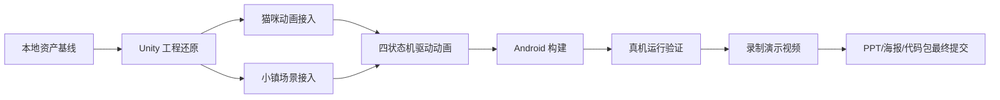

# CatLife MVP 非 Unity 准备工作总方案

日期：2026-06-29
范围：不直接操作 Unity Editor / Unity MCP 的前置工作、资料调研、实现方案、验证计划和交付物收口。

## 1. 当前状态基线

| 模块 | 已确认状态 | 关键位置 |
|---|---|---|
| 猫咪动画 | 已形成 10 动作最终包，Unity 验证包已能映射真实 Animator State | `06-deliverables/cat-animation-final-package-20260629/` |
| Unity MVP 增量资产 | 已有 `mvp-unity-assets`，包含 `mainscene`、Animator Controller、脚本、材质和 FBX `.meta` | `06-deliverables/unity-handoff-20260629/mvp-unity-assets/` |
| 猫咪小镇 | 当前安全源文件是 no-merge 版本，废弃 mesh merge 方案已归档 | `03-3d-models/catlife-town/current/catlife_v2_view_clean_no_merge.blend` |
| 小镇 Unity 状态 | 本地资产已存在，但未确认已进入当前 Unity 工程 | `03-3d-models/catlife-town/exports/catlife_v2.fbx` |
| Android 构建 | Unity AndroidPlayer 侧准备工作有过验证尝试，但 APK 未完成确认 | `06-deliverables/unity-handoff-20260629/UNITY_IMPORT_VALIDATION.md` |
| 复赛文档 | 冲刺计划、评审表、分工和资料包已存在 | `08-handoff-docs/`, `12-docs-package/` |

结论：下一阶段不是继续单独做 Blender 动画，而是把“猫 + 小镇 + 状态机 + Android 包 + 演示视频”串成可运行、可录制、可提交的闭环。

## 2. 官方资料调研结论

优先采用 Unity 和 Android 官方资料作为落地依据：

- Unity 图形优化文档强调先 Profiling 再优化，区分 CPU/GPU、Draw Call、Overdraw、贴图带宽和顶点处理瓶颈：https://docs.unity3d.com/Manual/OptimizingGraphicsPerformance.html
- Unity 模型导入设置建议默认关闭 Read/Write 以节省运行时内存，使用 Optimize Mesh、LOD、Weld Vertices、Mesh Compression 等导入侧手段：https://docs.unity3d.com/Manual/FBXImporter-Model.html
- Unity Android Player Settings 中，Android 可通过 Resolution Scaling、Static Batching、GPU Skinning、Texture Compression、IL2CPP、ARM64 等配置控制性能和构建兼容：https://docs.unity3d.com/Manual/class-PlayerSettingsAndroid.html
- Unity 贴图格式文档将 GPU 贴图格式选择和平台压缩列为运行时内存关键项：https://docs.unity3d.com/Manual/texture-compression-formats.html
- Android 游戏开发资料把 Unity on Android、Frame Pacing、Performance Tuner、内存与真机性能诊断列为移动游戏落地路径：https://developer.android.com/games/optimize

## 3. 项目级技术判断

1. 不用 Blender 视口状态判断移动端性能。Blender 面数、材质显示和 Unity 运行时成本不是同一指标，最终必须在 Android 设备或 Unity Profiler 中确认。
2. 当前小镇应从 no-merge 版本继续，避免再次采用 mesh merge。此前合并顶点破坏了材质、UV 和硬边表现，适合作为反例归档，不适合作为生产文件。
3. 162 万面整体资产不能直接假定移动端可流畅运行。低多边形手游角色可以有较高面数，但通常依赖 LOD、材质合批、遮挡剔除、骨骼预算、贴图压缩和机型分档；本项目是陪伴工具型 MVP，应以稳定 30 FPS 和低发热优先。
4. 竞赛交付比视觉极限更重要。先保证 APK 能启动、状态切换可演示、视频内容真实可复现，再做二级优化。

## 4. 非 Unity 工作分解

| 工作流 | 目标 | 产物 |
|---|---|---|
| 资产路径治理 | 保证所有人知道最新猫、最新小镇、废弃版本在哪里 | `PROJECT_FILE_MAP.md`、交付物索引、README 同步 |
| 小镇落地设计 | 在 Unity 导入前确定源文件、导入方式、材质、黑线毛刺和性能检查 | `CatLife_猫咪小镇场景Unity落地方案.md` |
| 移动端性能预算 | 提前定面数、Draw Call、材质、贴图、光照、粒子和动画预算 | `CatLife_移动端3D性能预算与优化方案.md` |
| Android 打包计划 | 明确 IL2CPP/ARM64、SDK、Build Settings、签名、安装验证和日志收集 | 执行计划文档 |
| 演示视频脚本 | 从可运行流程反推视频镜头，避免视频与 APK 不一致 | 从当前状态到 APK 与演示视频执行计划 |
| 评审材料收口 | PPT、海报、视频、APK、代码包逐项对照 | 评审检查表更新 |

## 5. MVP 集成闭环

## 6. 验收门禁

| 阶段 | 必须通过 | 失败处理 |
|---|---|---|
| 资产导入前 | 文件路径唯一，源文件和废弃文件不混用 | 回到索引表修正 |
| Unity 场景 | 猫在小镇中可见、大小正确、无飞起、状态切换有动作 | 用截图和场景层级定位 |
| 性能首测 | Android 或编辑器 Profiler 能给出 FPS、Batches、Triangles、内存 | 按小镇模块逐步禁用定位 |
| APK | 可安装、可启动、可完成专注流程 | 记录日志，先做 Development Build |
| 视频 | 镜头来自真实工程，不用与 APK 不一致的离线演示替代 | 重新录制对应段落 |

## 7. 下一步执行顺序

1. 在 Unity 侧只导入 `mvp-unity-assets` 和小镇当前导出，不再混入旧资产包。
2. 先打开 `mainscene` 确认动画猫正常，再加入小镇，避免同时引入两个变量。
3. 小镇按模块导入，先全景静态可见，再做材质修正，再做性能统计。
4. Android 先 Development Build + ARM64 + IL2CPP，能安装运行后再改 Release。
5. 录制视频时只录通过验证的功能链：启动、小镇、猫咪状态、专注开始、专注中、奖励反馈。
