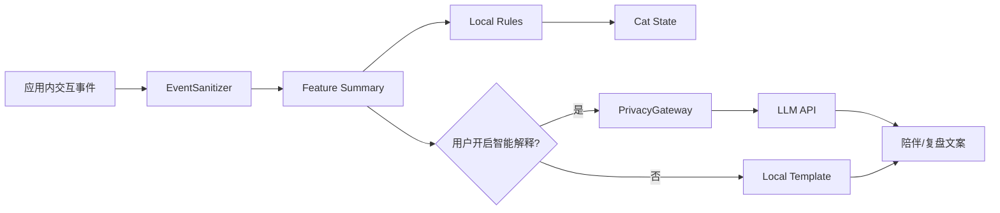

# CatLife 大模型代码包与隐私降级方案

日期：2026-06-29
目标：让复赛“大模型调用代码包”可解释、可审阅、可降级，不把隐私风险或密钥带进提交包。

## 1. 复赛表达口径

CatLife 的 AI 不应该被表述成“监控用户手机”。正确口径：

```text
本地规则识别专注状态 + 可选大模型生成陪伴解释文案
```

首发 MVP 的核心识别由本地规则完成，大模型只处理去标识化、聚合后的会话摘要，输出更自然的鼓励、复盘和陪伴文案。

复赛官方材料要求：必须阐释大模型应用场景，并通过 API 调用实现产品功能。代码打包时要重点标注 API 调用大模型的部分。因此“本地规则可独立运行”是产品稳定性要求，不等于可以不做模型调用展示。

## 2. 代码包边界

建议最终代码包包含：

| 文件 | 作用 |
|---|---|
| `README_LLM.md` | 说明模型用途、调用流程、隐私边界、运行方式 |
| `BehaviorFeatureSummary.cs` | 聚合特征结构，不含原始输入内容 |
| `PrivacyGateway.cs` | 上传前字段白名单和敏感字段拦截 |
| `LLMExplainClient.cs` | API 调用封装，含超时和错误处理 |
| `LocalTemplateFallback.cs` | 无网络/无 Key 时的本地模板降级 |
| `prompt_focus_explain.md` | 提示词模板，只接受聚合特征 |
| `sample_feature_summary.json` | 示例输入 |
| `sample_llm_response.json` | 示例输出 |

禁止包含：

- API Key、Token、Cookie、账号；
- 用户真实输入文本；
- 原始点击坐标序列；
- 截屏、OCR、跨 App 内容；
- 任何能识别个人身份的信息。

## 3. 数据流



## 4. 聚合特征示例

```json
{
  "session_id": "local-demo-001",
  "duration_sec": 1500,
  "focus_score_avg": 78,
  "arousal_score_avg": 22,
  "distraction_score_avg": 18,
  "focus_blocks": 3,
  "longest_focus_sec": 620,
  "interrupt_count": 2,
  "cat_state_sequence": ["NORMAL", "TRANSITION", "FOCUS", "REWARD"],
  "user_visible_goal": "复习高数",
  "locale": "zh-CN"
}
```

其中 `user_visible_goal` 必须来自用户主动填写的任务名；如果担心隐私，提交包 Demo 可以用固定示例。

## 5. Prompt 模板

```text
你是 CatLife 的陪伴式专注反馈助手。
请根据以下去标识化会话摘要生成一段 60 字以内的温和反馈。

要求：
1. 不责备用户。
2. 不编造未提供的数据。
3. 强调自主选择、稳定进步和猫咪陪伴。
4. 如果中断次数较高，用鼓励方式建议下一轮缩短目标。

会话摘要：
{{feature_summary_json}}
```

## 6. 降级策略

| 场景 | 行为 |
|---|---|
| 无网络 | 使用 `LocalTemplateFallback` |
| 无 API Key | 使用本地模板，UI 标记为“本地反馈” |
| API 超时 | 1.5 秒超时，返回模板 |
| API 错误 | 记录错误码，不展示技术错误给用户 |
| 隐私网关失败 | 不调用模型，返回安全模板 |
| 返回内容过长 | 本地截断到 60 字 |

## 7. 最小接口设计

```csharp
public interface IFocusFeedbackProvider
{
    Task<FocusFeedback> GenerateAsync(
        BehaviorFeatureSummary summary,
        CancellationToken cancellationToken);
}
```

```csharp
public sealed class FocusFeedback
{
    public string Text { get; init; }
    public string Source { get; init; } // "local_template" or "llm"
    public bool IsDegraded { get; init; }
}
```

## 8. 评审展示方式

PPT 中不要只写“大模型接入”。应展示：

1. 输入：聚合特征，不含隐私原文。
2. 处理：隐私网关过滤，模型只生成文案。
3. 输出：专注复盘/陪伴话术。
4. 降级：无网络也能运行。

演示视频中可以展示一段：

```text
本轮你安静陪猫复习了 25 分钟，中间有 2 次短暂停顿，但很快回来了。下一轮可以继续保持。
```

P0 和 P1 划分：

| 优先级 | 模型路线 | 用途 |
|---|---|---|
| P0 | 第三方云端 API 或可运行的最小 LLM Demo | 证明“通过 API 调用实现产品功能” |
| P1 | vivo 蓝心 3B 端侧模型 | 加分项：隐私、安全、低延迟、离线猫咪短回复 |
| P2 | 端侧 + 云端混合 | 决赛或深度打磨：端侧实时反馈，云端复杂总结 |

## 9. 代码包验收

| 项 | 标准 |
|---|---|
| 可读 | README 解释用途、输入、输出、密钥配置 |
| 可跑 | 有 sample 输入输出，不依赖真实用户数据 |
| 安全 | 搜索不到 `sk-`、`api_key=`、手机号、邮箱等敏感信息 |
| 可降级 | 无 Key 时仍能本地生成反馈 |
| 可对齐产品 | 输出文案能驱动猫咪陪伴和专注复盘 |
