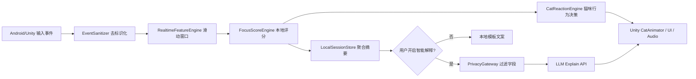

# CatLife 非敏感用户行为识别与猫咪行为控制实现方案

版本：v1.0
日期：2026-06-24
适用范围：Android 首发 MVP、Unity 猫咪状态机、可选 LLM 解释层
输入依据：`应用识别用户操作频率并实时驱动猫咪反应模块技术实现方案研究报告`

## 1. 核心结论

CatLife 首发版只做**非敏感、应用内、本地优先**的行为识别：

```text
应用内交互事件 -> 去标识化特征 -> 本地评分器 -> 猫咪状态机 -> 动作/表情/UI反馈
```

默认不做：

- 不录屏。
- 不读取输入内容。
- 不采集跨 App 点击/滚动/屏幕内容。
- 不使用 AccessibilityService 监控其他 App。
- 不上传原始触摸轨迹、原始坐标序列、完整包名列表。

可以做：

- 统计本 App 内点击、滑动、输入节奏、页面切换、停留时长。
- 统计聚合后的操作频率、停顿、误触、切换强度。
- 本地实时计算 `focus_score`、`arousal_score`、`distraction_score`。
- 用规则引擎驱动猫咪普通、过渡、专注、奖励四状态。
- 用户明确打开“智能解释”后，只上传聚合特征给 LLM 生成陪伴文案。

Android 后续增强能力：可选接入 `UsageStatsManager` 读取粗粒度切屏/前后台变化，但必须单独开关、单独授权、单独说明。复赛 MVP 不依赖它。

## 2. MVP 能力边界

| 层级 | 首发是否做 | 说明 |
|---|---|---|
| 应用内点击/滑动/输入节奏 | 做 | 主路径，无额外敏感权限 |
| 应用内页面切换/停留 | 做 | 用于判断分心、停留、专注趋势 |
| 锁屏/亮屏/运动弱信号 | 可做 | 仅作辅助，不作为核心判断 |
| Android UsageStats 粗粒度切屏 | 后续做 | 高级授权模式，不进首发硬依赖 |
| Accessibility 全局监控 | 不做 | 审核与隐私风险高 |
| MediaProjection 录屏/OCR | 不做 | 过度采集，不符合桌宠专注工具定位 |
| 原始输入内容 | 不做 | 只记录长度变化、删改节奏 |
| 云端原始行为流 | 不做 | 只允许聚合特征，且需用户同意 |

## 3. 系统架构



模块职责：

| 模块 | 职责 | 运行位置 |
|---|---|---|
| `InteractionEventCollector` | 收集本 App 内 touch/scroll/input/page/lifecycle | Android 原生层或 Unity 输入层 |
| `EventSanitizer` | 删除文本内容，量化坐标，裁剪字段 | 本地 |
| `RealtimeFeatureEngine` | 1s/5s/30s 滑动窗口统计 | 本地 |
| `FocusScoreEngine` | 计算 focus/arousal/distraction 三分值 | 本地 |
| `CatReactionEngine` | 映射猫咪状态、动画、表情、提示 | Unity |
| `LocalSessionStore` | 存会话摘要，不存原始事件流 | 本地 |
| `PrivacyGateway` | 判断能否上传，过滤敏感字段 | 本地 |
| `LLMExplainClient` | 可选生成解释型文案 | 云端增强 |

## 4. 非敏感事件字典

事件统一结构：

```json
{
  "ts_ms": 1710000000000,
  "event_type": "tap",
  "route_id": "main_town",
  "zone_id": "z_05_08",
  "duration_ms": 120,
  "delta_len": 0,
  "deleted": false,
  "scroll_dy": 0.0,
  "velocity": 0.0,
  "scene_state": "foreground_active"
}
```

字段规则：

| 字段 | 含义 | 是否可存原始值 | 处理方式 |
|---|---|---:|---|
| `ts_ms` | 事件时间戳 | 是 | 可保留毫秒或降采样到 100ms |
| `event_type` | 事件类型 | 是 | 枚举值 |
| `route_id` | 页面/场景 ID | 是 | 使用内部 ID，不用页面标题 |
| `zone_id` | 触点热区 | 否 | 原始坐标量化成 8x12 网格 |
| `duration_ms` | 按压/停留时长 | 是 | 截断到合理范围 |
| `delta_len` | 输入长度变化 | 是 | 只记录长度变化，不记录文本 |
| `deleted` | 是否删除输入 | 是 | 布尔值 |
| `scroll_dy` | 滚动距离 | 是 | 可归一化 |
| `velocity` | 滚动/滑动速度 | 是 | 裁剪极端值 |
| `scene_state` | App 前后台状态 | 是 | 仅本 App 生命周期 |

事件类型：

| 事件 | 来源 | 用途 | 禁止记录 |
|---|---|---|---|
| `tap` | 点击 | 操作频率、兴奋度 | 原始坐标序列 |
| `long_press` | 长按 | 迟疑/稳定交互 | 具体按压内容 |
| `swipe` | 滑动手势 | 活跃度、退出意图 | 全轨迹 |
| `scroll` | 列表/页面滚动 | 浏览节奏 | 屏幕内容 |
| `input_edit` | 文本变化 | 输入节奏 | 输入文本 |
| `page_switch` | 页面切换 | 任务跳转 | 页面可读标题 |
| `app_fg` / `app_bg` | 生命周期 | 离开/返回 | 其他 App 名称 |
| `focus_start` / `focus_end` | 专注入口 | 会话边界 | 无 |
| `device_weak_signal` | 锁屏/亮屏/运动 | 辅助判断 | 精确位置、隐私传感器 |

## 5. 实时特征计算

### 5.1 窗口设置

| 窗口 | 刷新频率 | 用途 |
|---|---:|---|
| 1 秒 | 200ms | 即时兴奋/快速操作 |
| 5 秒 | 500ms | burst、停顿、短时节奏 |
| 30 秒 | 1s | 专注趋势、分心趋势 |
| 会话级 | 专注结束 | 成长值、历史摘要 |

### 5.2 特征表

| 特征 | 计算方式 | 用途 |
|---|---|---|
| `tap_rate_1s` | 1s 内 tap 数 / 1s | 即时活跃度 |
| `tap_rate_5s` | 5s 内 tap 数 / 5s | 操作强度 |
| `scroll_velocity_p95` | 5s 滚动速度 p95 | 快速刷动识别 |
| `scroll_consistency` | 滚动速度稳定性 | 阅读/浏览连续性 |
| `edit_rate_5s` | 5s 输入编辑次数 | 输入状态 |
| `delete_ratio` | 删除次数 / 编辑次数 | 反复修改/焦躁代理 |
| `mean_interaction_gap` | 事件间隔均值 | 安静程度 |
| `idle_duration` | 连续无操作时长 | 专注/离开判断 |
| `page_switch_rate_30s` | 30s 页面切换次数 | 分心/探索 |
| `touch_zone_entropy` | 热区分布熵 | 触点分散程度 |
| `mistouch_ratio` | 极短 tap + 无后续停留占比 | 误触/急躁 |
| `foreground_ratio` | App 前台活跃比例 | 会话有效性 |
| `motion_ratio` | 运动弱信号比例 | 移动/静止辅助 |

### 5.3 初始阈值

| 参数 | 初值 | 说明 |
|---|---:|---|
| `TH_TAP_BURST` | 4 tap/s | 1 秒内快速点击 |
| `TH_SCROLL_BURST` | 1400 px/s | 快速刷动 |
| `TH_IDLE_TRANSITION` | 8s | 从普通转入过渡的候选停顿 |
| `TH_IDLE_FOCUS` | 25s | 低交互维持后进入专注 |
| `TH_SWITCH_HIGH` | 4 / 30s | 频繁切页 |
| `TH_MISTOUCH_HIGH` | 0.18 | 误触比例偏高 |
| `STATE_MIN_DWELL` | 3s | 防止状态抖动 |
| `FOCUS_CONFIRM_TIME` | 30s | 专注态确认时间 |

这些阈值是原型初值，必须根据真机测试和用户反馈调参。

## 6. 三分值评分器

不要只用一个专注分。猫咪行为至少需要三个分值：

| 分值 | 含义 | 高分表现 |
|---|---|---|
| `focus_score` | 专注稳定程度 | 安静、低切换、低误触、连续停留 |
| `arousal_score` | 操作兴奋/活跃程度 | 高频 tap、快速滚动、连续互动 |
| `distraction_score` | 分心/跳转程度 | 高频切页、误触、离开返回、短停留 |

初始公式：

```text
activity = 0.35*tap_rate_norm
         + 0.25*scroll_burst_norm
         + 0.20*edit_burst_norm
         + 0.20*page_switch_norm

stability = 0.30*dwell_continuity
          + 0.25*scroll_consistency
          + 0.20*low_mistouch
          + 0.15*low_switch
          + 0.10*stillness_ratio

focus_score = clamp(100 * (0.65*stability + 0.35*idle_focus_signal - 0.25*activity_spike))
arousal_score = clamp(100 * (0.55*tap_rate_norm + 0.30*scroll_burst_norm + 0.15*edit_burst_norm))
distraction_score = clamp(100 * (0.45*page_switch_norm + 0.35*mistouch_norm + 0.20*return_interrupt_norm))
```

平滑：

```text
score_smooth = previous * 0.75 + current * 0.25
```

低置信度处理：

- 当前台事件少于 3 个且无专注会话时，不主动提醒。
- App 刚启动前 10 秒只做观察，不进入专注态。
- 状态变化必须满足最短驻留时间，避免猫咪抖动。

## 7. 猫咪行为控制方案

### 7.1 四状态定义

| 状态 | 触发 | 猫咪行为 | UI |
|---|---|---|---|
| `NORMAL` 普通 | `arousal_score >= 45` 或刚进入主界面 | 走动、看向用户、尾巴摆动、可互动 | 完整按钮 |
| `TRANSITION` 过渡 | 操作下降、`focus_score >= 45` 且持续 8s | 靠近、坐下、慢眨眼 | 弱提示、减少刺激 |
| `FOCUS` 专注 | `focus_score >= 70` 且持续 30s | 趴下、安静陪伴、低频呼吸动画 | 轻锁定、隐藏干扰按钮 |
| `REWARD` 奖励 | 专注会话完成 | 伸懒腰、蹭屏、轻庆祝 | 成长值、记录卡片 |

### 7.2 状态转移规则

```text
NORMAL -> TRANSITION:
  focus_score >= 45
  AND arousal_score < 45
  AND idle_duration >= 8s
  AND 当前状态停留 >= 3s

TRANSITION -> FOCUS:
  focus_score >= 70
  AND distraction_score < 35
  AND 条件持续 >= 30s

TRANSITION -> NORMAL:
  arousal_score >= 60
  OR distraction_score >= 55

FOCUS -> NORMAL:
  用户上滑退出
  OR distraction_score >= 65 持续 5s

FOCUS -> REWARD:
  专注计时完成
  OR 用户完成设定任务

REWARD -> NORMAL:
  奖励动画播放完成 1.2s 后
```

### 7.3 猫咪动作映射

| 行为 ID | 状态 | 动画 | 表情 | 音效 | 触发条件 |
|---|---|---|---|---|---|
| `cat_idle_look` | NORMAL | 站立/看向屏幕 | 好奇 | 无 | 默认 |
| `cat_tail_active` | NORMAL | 尾巴快摆 | 兴奋 | 轻铃 | `arousal_score > 65` |
| `cat_approach` | TRANSITION | 靠近坐下 | 温和 | 轻脚步 | 进入过渡 |
| `cat_slow_blink` | TRANSITION | 慢眨眼 | 平静 | 无 | 过渡稳定 |
| `cat_lie_down` | FOCUS | 趴下 | 安静 | 呼噜低频 | 进入专注 |
| `cat_breathe` | FOCUS | 呼吸循环 | 闭眼 | 极低音量 | 专注持续 |
| `cat_peek` | FOCUS | 轻抬头 | 关心 | 无 | 轻微分心但未退出 |
| `cat_stretch` | REWARD | 伸懒腰 | 开心 | 轻铃 | 专注完成 |
| `cat_star_paw` | REWARD | 小跳/蹭屏 | 开心 | 奖励音 | 奖励 burst |

### 7.4 文案策略

文案分两层：

| 层 | 来源 | 示例 | 是否依赖网络 |
|---|---|---|---|
| 本地模板 | 规则引擎 | “我会安静陪着你。” | 否 |
| LLM 解释 | 聚合特征 + 用户同意 | “刚才你的节奏很稳，可以继续保持。” | 是，可选 |

本地模板触发规则：

| 状态 | 模板 |
|---|---|
| NORMAL | “先不用急，我在这里。” |
| TRANSITION | “你慢下来了，我也安静一点。” |
| FOCUS | “我会轻轻陪着你，不打扰。” |
| REWARD | “完成啦，猫咪给你一个小爪印。” |
| DISTRACTION_HIGH | “要不要先回到刚才那件事？” |

## 8. 数据存储方案

### 8.1 存储原则

默认只存会话摘要，不存原始事件流。

| 数据 | 保存时间 | 是否默认保存 | 说明 |
|---|---:|---:|---|
| 原始事件 | 30-120s 内存环形缓存 | 否 | 只在内存用于实时计算 |
| 窗口特征 | 当前会话 | 是 | 可用于状态机 |
| 会话摘要 | 7-30 天 | 是 | 专注记录、成长值 |
| LLM 请求特征 | 按用户开关 | 否 | 开启智能解释才发送 |
| 输入内容 | 0 | 否 | 永不保存 |
| 屏幕内容 | 0 | 否 | 永不采集 |

### 8.2 会话摘要表

```json
{
  "session_id": "local-uuid",
  "started_at": 1710000000000,
  "ended_at": 1710000900000,
  "duration_sec": 900,
  "focus_duration_sec": 620,
  "avg_focus_score": 74.2,
  "max_distraction_score": 42.0,
  "state_transitions": {
    "normal_to_transition": 2,
    "transition_to_focus": 1,
    "focus_to_reward": 1
  },
  "privacy_mode": "local_only"
}
```

## 9. LLM 接入边界

LLM 不参与即时动作决策，只做解释增强。

允许上传：

- `focus_score`
- `arousal_score`
- `distraction_score`
- 30s 聚合特征
- 当前猫咪状态
- 会话阶段

禁止上传：

- 原始文本。
- 原始坐标。
- 屏幕截图。
- 完整触摸轨迹。
- 完整应用列表。
- 联系人、剪贴板、相册等任何无关信息。

请求示例：

```json
{
  "window_sec": 30,
  "features": {
    "tap_rate_5s": 0.2,
    "scroll_velocity_p95": 120.0,
    "page_switch_rate_30s": 0.0,
    "mistouch_ratio": 0.02,
    "focus_score": 82.0,
    "arousal_score": 18.0,
    "distraction_score": 9.0
  },
  "pet_state": "FOCUS",
  "privacy": {
    "raw_text_included": false,
    "raw_touch_path_included": false,
    "screen_content_included": false
  }
}
```

超时与回退：

| 条件 | 处理 |
|---|---|
| LLM 超时 > 600ms | 用本地模板 |
| 连续失败 3 次 | 冷却 5 分钟 |
| 用户关闭智能解释 | 不请求云端 |
| 隐私网关发现敏感字段 | 阻断请求并记录本地错误 |

## 10. Android MVP 实现路径

### 10.1 原生层采集

建议先在 Android Activity 层建立事件桥，再转发给 Unity：

```kotlin
class CatLifeActivity : UnityPlayerActivity() {
    override fun dispatchTouchEvent(ev: MotionEvent): Boolean {
        InteractionBridge.onMotionEvent(ev, currentRouteId())
        return super.dispatchTouchEvent(ev)
    }
}
```

文本输入只记录长度变化：

```kotlin
class SafeTextWatcher : TextWatcher {
    private var lastLength = 0

    override fun afterTextChanged(s: Editable?) {
        val current = s?.length ?: 0
        val delta = current - lastLength
        InteractionBridge.onInputEdit(deltaLen = delta, deleted = delta < 0)
        lastLength = current
    }

    override fun beforeTextChanged(s: CharSequence?, start: Int, count: Int, after: Int) {}
    override fun onTextChanged(s: CharSequence?, start: Int, before: Int, count: Int) {}
}
```

生命周期：

```kotlin
class CatLifeApp : Application(), Application.ActivityLifecycleCallbacks {
    override fun onActivityResumed(activity: Activity) {
        InteractionBridge.onSceneState("foreground_active")
    }

    override fun onActivityPaused(activity: Activity) {
        InteractionBridge.onSceneState("foreground_inactive")
    }
}
```

### 10.2 Unity 层接口

```csharp
public enum CatLifeVisualState
{
    Normal,
    Transition,
    Focus,
    Reward
}

public struct BehaviorScores
{
    public float Focus;
    public float Arousal;
    public float Distraction;
    public float Confidence;
}

public interface ICatReactionDriver
{
    void ApplyScores(BehaviorScores scores);
    void SetState(CatLifeVisualState state, string reason);
    void PlayReaction(string reactionId);
}
```

## 11. Unity 猫咪控制实现

核心脚本：

```text
Assets/CatLife/Scripts/Behavior/
  InteractionEvent.cs
  RealtimeFeatureEngine.cs
  FocusScoreEngine.cs
  CatReactionEngine.cs
  PrivacyGateway.cs
  LocalSessionStore.cs

Assets/CatLife/Scripts/Cat/
  CatAnimatorController.cs
  CatMoodController.cs
  CatAudioController.cs
```

Animator 参数：

| 参数 | 类型 | 说明 |
|---|---|---|
| `State` | int | 0 Normal, 1 Transition, 2 Focus, 3 Reward |
| `Arousal` | float | 控制尾巴/速度 |
| `Focus` | float | 控制趴下/呼吸 |
| `Distraction` | float | 控制抬头/轻提醒 |
| `TriggerReward` | trigger | 奖励动画 |
| `TriggerPeek` | trigger | 专注中轻抬头 |

动画状态机：

```text
IdleActive -> Approach -> SitCalm -> LieFocus -> RewardStretch -> IdleActive
```

门禁：

- 状态切换必须平滑，不能 1 秒内来回抖动。
- 猫咪反应延迟目标 < 160ms。
- 专注态视觉噪声最低，不增加大量粒子。
- LLM 失败不影响动作状态机。

## 12. 隐私与权限门禁

### 12.1 P0 隐私门禁

| 编号 | 检查项 | 通过标准 |
|---|---|---|
| P0-PRIV-01 | 不记录输入内容 | 代码中无原始文本持久化 |
| P0-PRIV-02 | 不录屏 | 无 MediaProjection 路径 |
| P0-PRIV-03 | 不用 Accessibility | 首发无 AccessibilityService |
| P0-PRIV-04 | 本地优先 | 无网络时猫咪仍可反应 |
| P0-PRIV-05 | 云端可关 | 智能解释有独立开关 |
| P0-PRIV-06 | 清除数据 | 设置页可清除会话摘要 |

### 12.2 数据字段门禁

任何上云请求必须满足：

```text
raw_text_included == false
raw_touch_path_included == false
screen_content_included == false
user_consented_cloud_ai == true
```

若任一不满足，请求必须被 `PrivacyGateway` 阻断。

## 13. 质量门禁

### P0：首发必须完成

| 编号 | 门禁 | 通过标准 |
|---|---|---|
| B-P0-01 | 应用内事件采集 | tap/scroll/input/page/lifecycle 能进入统一事件流 |
| B-P0-02 | 去标识化 | 无文本内容、无原始坐标轨迹 |
| B-P0-03 | 实时评分 | 1s/5s/30s 特征可计算 |
| B-P0-04 | 四状态猫咪 | Normal/Transition/Focus/Reward 可切换 |
| B-P0-05 | 无网可用 | 断网后猫咪动作和本地文案正常 |
| B-P0-06 | 隐私说明 | 设置页有本地统计说明 |

### P1：复赛展示加分

| 编号 | 门禁 | 通过标准 |
|---|---|---|
| B-P1-01 | 分值可视化 | Debug 面板显示三分值与状态 |
| B-P1-02 | 轻锁定联动 | Focus 状态隐藏/弱化干扰按钮 |
| B-P1-03 | 奖励记录 | Reward 状态写入专注时长和成长值 |
| B-P1-04 | LLM 解释 | 用户开启后能基于聚合特征生成一句文案 |
| B-P1-05 | 隐私开关 | 可关闭智能解释与清除历史 |

### P2：后续增强

| 编号 | 门禁 | 通过标准 |
|---|---|---|
| B-P2-01 | Android UsageStats | 单独授权，仅统计粗粒度切屏 |
| B-P2-02 | 个性化阈值 | 根据用户反馈微调阈值 |
| B-P2-03 | 模型化评分 | 用轻量模型替代部分规则 |

## 14. 一周落地排期

| 天 | 任务 | 产出 |
|---|---|---|
| Day 1 | 事件字典与 Unity 接口定稿 | `behavior_event_schema.json` |
| Day 2 | Android/Unity 事件采集桥 | 事件流进入 Unity Debug |
| Day 3 | 滑动窗口特征与评分器 | `focus/arousal/distraction` 实时刷新 |
| Day 4 | 猫咪四状态映射 | Animator 状态可被评分驱动 |
| Day 5 | 会话摘要与隐私网关 | 本地摘要、清除数据、云端阻断 |
| Day 6 | LLM 可选解释 | 聚合特征请求 + 本地回退 |
| Day 7 | 真机调参和复赛演示脚本 | Debug 面板截图、演示视频素材 |

## 15. 交付文件

必须交付：

```text
07-tech-specs/CatLife_非敏感行为识别与猫咪行为控制实现方案.md
07-tech-specs/behavior_event_schema.json
07-tech-specs/cat_reaction_state_table.json
```

后续工程建议：

```text
Assets/CatLife/Scripts/Behavior/
Assets/CatLife/Scripts/Cat/
Assets/CatLife/Configs/behavior_event_schema.json
Assets/CatLife/Configs/cat_reaction_state_table.json
```
