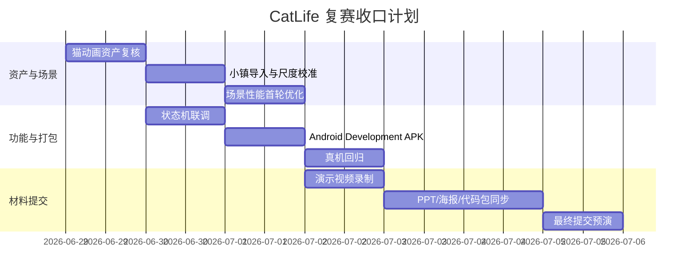

# CatLife MVP 从当前状态到 APK 与演示视频执行计划

日期：2026-06-29
目标：从当前本地资产状态推进到可安装 APK、可录制演示视频、可提交复赛材料。

## 1. 当前可用输入

| 输入 | 位置 | 用途 |
|---|---|---|
| 10 动作猫 FBX | `06-deliverables/cat-animation-final-package-20260629/CatLife_cat_10_actions_final_state.fbx` | Unity 动画角色 |
| 动作清单 | `06-deliverables/cat-animation-final-package-20260629/cat_actions_manifest.json` | Animator state 对照 |
| MVP Unity 增量资产 | `06-deliverables/unity-handoff-20260629/mvp-unity-assets/` | 还原 `mainscene` 动画猫 |
| Runtime Patch | `06-deliverables/unity-handoff-20260629/runtime-patch/` | 脚本更新说明 |
| 小镇当前源 | `03-3d-models/catlife-town/current/catlife_v2_view_clean_no_merge.blend` | 小镇生产源 |
| 小镇现有导出 | `03-3d-models/catlife-town/exports/catlife_v2.fbx` | Unity 初始导入候选 |
| Unity 验证记录 | `06-deliverables/unity-handoff-20260629/UNITY_IMPORT_VALIDATION.md` | 已完成和未完成项 |

## 2. 总体阶段



## 3. P0 执行清单

### P0-1 还原 Unity MVP 猫

目标：先恢复已经验证过的动画猫，不同时引入小镇变量。

操作要点：

1. 把 `mvp-unity-assets/Assets/` 覆盖到正式 Unity 工程的 `Assets/`。
2. 把 FBX 复制到 `Assets/Art/Cat/Animations/`。
3. 打开 `mainscene`，确认 `CatModel_AnimatedMVP` 可见。
4. 播放 Normal -> Transition -> Focus -> Reward。
5. 截图保留到 `06-deliverables/unity-handoff-20260629/qa-screenshots/`。

通过标准：

- Console 没有 runtime error；
- 4 状态都能触发动作；
- 猫没有飞起、缩放错误、方向明显错误。

### P0-2 导入猫咪小镇

目标：将小镇作为主场景环境导入。

操作要点：

1. 从 `catlife_v2_view_clean_no_merge.blend` 重新导出 Unity 运行时版本。
2. 优先导入地面、广场、主建筑，再导入装饰物。
3. 建立 `CatLifeTownRoot` Prefab。
4. 根据猫身高和镜头重新校准小镇 scale。
5. 记录 Batches、Triangles、SetPass、FPS。

通过标准：

- Game View 中能看到小镇和猫；
- 入口、广场、主建筑构图清楚；
- 黑线毛刺不影响 Game View；
- 记录第一版性能数据。

### P0-3 Android Development Build

目标：先拿到可安装 APK。

关键配置：

- Scripting Backend：IL2CPP；
- Target Architecture：ARM64；
- Build Type：Development；
- Texture Compression：ASTC 优先；
- Scenes In Build：`startscene`、`mainscene`、`FocusScene`；
- 开启 Development Build 方便日志定位。

通过标准：

- APK 生成；
- 手机可安装；
- 启动到主流程；
- 至少能完成一次专注开始、状态变化、奖励反馈。

### P0-4 真机验证与录制

目标：视频内容来自真实 APK 或真实 Unity Game View。

录制镜头顺序：

1. 启动页或主界面 3 秒；
2. 小镇全景 5 秒；
3. 猫咪近景 idle 5 秒；
4. 用户开始专注，猫进入过渡动作 5 秒；
5. 专注中猫安静陪伴 8 秒；
6. 完成奖励，猫尾巴/开心动作 6 秒；
7. 结尾展示产品亮点和提交信息。

## 4. P1 优化清单

| 项 | 动作 | 预期收益 |
|---|---|---|
| 小镇分层 | 拆分地面/建筑/树木/小道具 | 便于定位性能瓶颈 |
| 材质合并 | 低多边形色板复用 | 降低 SetPass |
| 贴图压缩 | ASTC/ETC2，限制尺寸 | 降低包体和显存 |
| LOD | 树木、栅栏、建筑远景降级 | 降低顶点处理 |
| 阴影 | 只保留主角色或关键建筑阴影 | 降低 GPU 压力 |
| 录屏模式 | 30 FPS 锁帧，固定镜头 | 避免演示抖动 |

## 5. 提交物收口

| 提交物 | 内容 | 产出位置 |
|---|---|---|
| APK | 最终可安装包 | `06-deliverables/final-submission/` |
| 演示视频 | <=5min，真实流程 | `06-deliverables/final-submission/` |
| PPT | 技术、创新、应用价值、完成度 | `06-deliverables/final-submission/` |
| 海报 | 产品定位 + 截图 + 技术亮点 | `06-deliverables/final-submission/` |
| 代码包 | Unity/Android/AI 相关代码，去除密钥 | `06-deliverables/final-submission/` |
| 提交校验表 | 文件名、大小、打开状态、截图 | `08-handoff-docs/planning/` |

## 6. 风险与降级

| 风险 | 降级方案 |
|---|---|
| 小镇太重导致 APK 卡顿 | 只保留广场、入口、主建筑和猫；其他装饰远景烘焙成静态背景或删减 |
| Android 构建失败 | 先用 Unity Game View 录制视频，同时保留构建日志继续修复 |
| 第 10 个动作未验收 | 视频只使用前 9 个已验收动作，第 10 个不作为核心展示 |
| 黑线毛刺进入 Unity | 优先材质 Opaque、关闭透明阴影、查重叠面，不回退到 mesh merge |
| 视频时间不足 | 以“产品闭环 + 猫咪小镇 + AI 状态解释”为主，不展示全部动作 |

## 7. 完成定义

最终完成不是单个场景或单个动画完成，而是以下闭环成立：

```text
本地资产明确 -> Unity 场景可运行 -> Android APK 可安装 -> 真机流程可录制 -> 视频/PPT/海报/代码包一致 -> 提交前逐项打开检查
```
